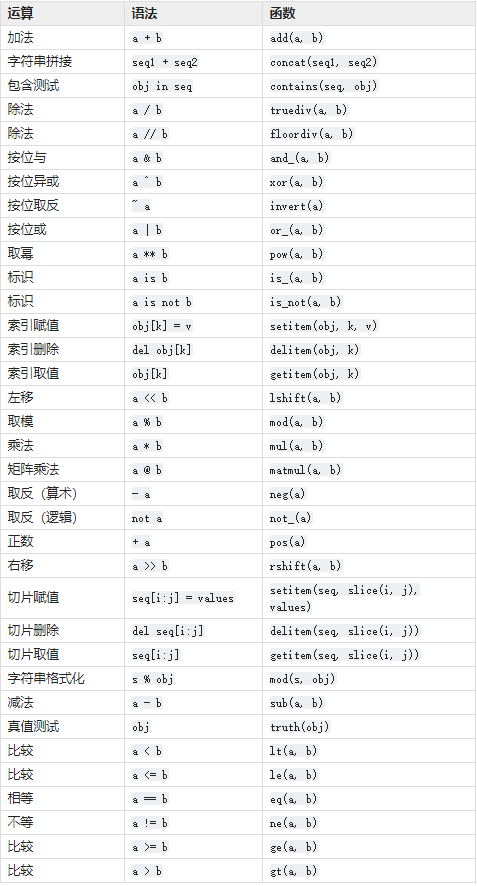

# operator库
> 方法集合
```python
__all__ = ['abs', 'add', 'and_', 'attrgetter', 'concat', 'contains', 'countOf',
           'delitem', 'eq', 'floordiv', 'ge', 'getitem', 'gt', 'iadd', 'iand',
           'iconcat', 'ifloordiv', 'ilshift', 'imatmul', 'imod', 'imul',
           'index', 'indexOf', 'inv', 'invert', 'ior', 'ipow', 'irshift',
           'is_', 'is_not', 'isub', 'itemgetter', 'itruediv', 'ixor', 'le',
           'length_hint', 'lshift', 'lt', 'matmul', 'methodcaller', 'mod',
           'mul', 'ne', 'neg', 'not_', 'or_', 'pos', 'pow', 'rshift',
           'setitem', 'sub', 'truediv', 'truth', 'xor']
```
**operator 模块(C模块)提供了一套与Python的内置运算符对应的高效率函数**

